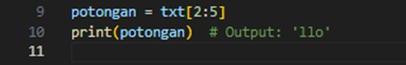

# Latihan String

### latihan1

1.	Hitung jumlah karakternya
     * Menggunakan fungsi len() untuk menghitung panjang string:

     

2.	Mengambil karakter terakhir
     * Menggunakan indeks negatif -1 untuk mengakses karakter terakhir:

     
 

3.	Mengambil karakter indeks ke-2 sampai indeks ke-4 (llo)
     * Menggunakan slicing dengan indeks 1:4 (indeks Python dimulai dari 0):

     
 
4.	Menghilangkan spasi pada teks tersebut (HelloWorld)
     * Menggunakan metode .replace() untuk mengganti spasi dengan string kosong:

     
 
5.	Mengubah teks menjadi huruf besar
     * Menggunakan metode .upper() untuk mengubah seluruh teks menjadi huruf besar:

     
 
6.	Mengubah teks menjadi huruf kecil
     * Menggunakan metode .lower() untuk mengubah seluruh teks menjadi huruf kecil:

     

7.	Mengganti karakter H dengan karakter J
     * Menggunakan metode .replace() untuk mengganti karakter H dengan J:

     

### latihan2

* **Penjelasan:**
     * Melengkapi kode;
         1.	Variabel umur berisi angka 24 yang akan dimasukkan ke dalam string format.
         2.	Teks pada variabel txt ditambah placeholder {} yang digunakan untuk menyisipkan nilai menggunakan metode .format().
         3.	Metode .format() digunakan untuk mengganti placeholder {} dengan nilai yang diberikan sebagai argumen, dalam hal ini nilai dari variabel umur.
         * Output:

         
 

### latihan3

**Studi kasus; Validasi form input**
* **Kriteria Validasi:**
     1.	Nama lengkap (harus hanya berisi huruf)
     2.	Nomor telepon (harus hanya berisi angka)
     3.	Email (harus mengandung kararakter @ dan .)
     4.	Jika semua validasi berhasil, tampilkan pesan; Data Pendaftaran Valid. Jika tidak, tampilkan pesan error untuk setiap kesalahan.

**Contoh kode Program**

**Penjelasan Program:**
1.	Input Data:
     * Program menerima tiga input dari pengguna: nama_lengkap, nomor_telepon, dan email.
2.	Validasi Data:
     * Setiap input divalidasi berdasarkan kriteria:
         - Nama lengkap divalidasi dengan .isalpha().
         - Nomor telepon divalidasi dengan .isdigit().
         - Email diperiksa apakah mengandung (@ dan .).
3.	Penyimpanan Error:
     * Jika input tidak valid, pesan error ditambahkan ke dalam daftar errors.
4.	Output Validasi:
     * Jika semua data valid, program menampilkan pesan: "Data pendaftaran valid."
     * Jika ada kesalahan, program mencetak daftar pesan error.

**Contoh Input dan Output**
**Tidak valid:**
 

**Input valid:**

 